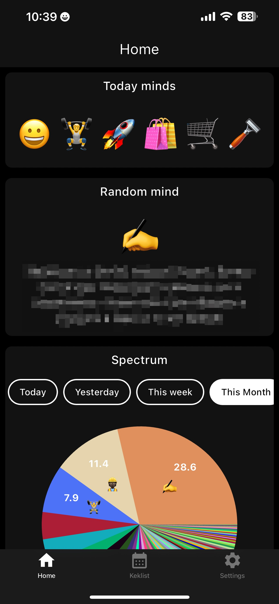
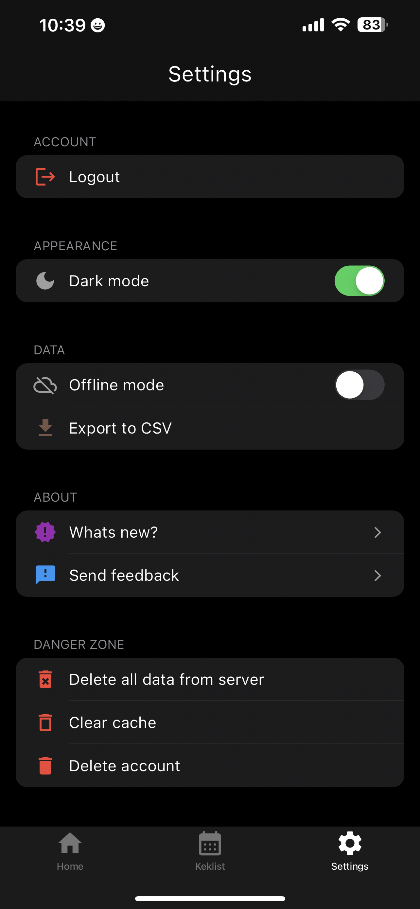

# Keklist

Contents:
- What?
- Why is this project exist?
- What are main features?
- Why open-source?
- How to build?
- How to support?
- Stack

# What
Keklist is app for collection minds of any types. It could be emotion, mind, something fun, spark, inspiration, achievement and even kek or lol. 

The main idea of Keklist to provide easy-to-use collector of minds at the moment and analyze in the future.

Way of providing of mind it is simple - you need to have only Text and Emoji.

# Why is Keklist exist?
Time is most important thing that we have in our lives because it's limited. I was woundering how can I track importance of each day.

The first thing that comes to mind is writing a diary for it. This way has a lot of problems. Main is if you do it by hand with paper and pen - it's not convenient. There are also lack of security, privacy and other problems that paper has.

Of course we have a lot modern ways to do it from a many apps in mobile stores to big gigants like Notion, Obsidian etc. But you give an access to your data for these corporations and in the future I can hurt by it.

My personal opinion that these kind of tools should be open-source for let to users be aware that you use their data properly and if said something about security and privacy you can proove it by your actions (by code for an instance).

With Keklist I'm trying to resolve this kind of problems. Firstly, I'm trying to do it for myself and I will be happy if I be able to do it for society as well.

## Screenshots

|                  Calendar                   |                    Home                     |                  Settings                   |
| :-----------------------------------------: | :-----------------------------------------: | :-----------------------------------------: |
|  |  |  |

# What are main features?
- iOS, Android support
- Auth with: Email, Google, Apple, Facebook
- Infinitely calendar of minds
- Home screen with Insights (Charts and analytics)
- Date switching
- Reflections for minds
- Offline mode
- WatchOS App
- iOS Widgets
- Dark Mode
- User data management
- Widescreens support (Tablets, Desktop)

# Why is open-source?
- Community
- Transparency
- Long-term existing

# How to build?
// TODO: write an instruction

# How to support?
- Reach me in [Telegram](t.me/sashkyn) or by email sashkn2@gmail.com
- You are more than welcome for issues, proposals and PRs

# Stack

## Main stack
- Flutter
- bloc
- iOS/Swift
- Supabase
## Third party
| Dependency                          | Reason                                                          |
| ----------------------------------- | --------------------------------------------------------------- |
| flutter                             | Flutter SDK                                                     |
| adaptive_dialog                     | For using Platform dialogs                                      |
| bloc, flutter_bloc                  | Main achitecture of app for state management                    |
| blur                                | Blurring effect for auth background animation                   |
| calendar_date_picker2               | Calendar date picker                                            |
| collection                          | Utility functions for lists                                     |
| cross_file                          | Cross-platform file operations                                  |
| csv                                 | CSV parsing and writing                                         |
| cupertino_icons                     | Cupertino-style icons                                           |
| emojis                              | Emoji support                                                   |
| equatable                           | Value equality                                                  |
| fast_immutable_collections          | Immutable collections                                           |
| fl_chart                            | Insights charts                                                 |
| flutter_localizations               | Localization of app                                             |
| flutter_animate                     | Animation utilities                                             |
| flutter_easyloading                 | Blocking UI progress                                            |
| flutter_emoji                       | Emoji rendering                                                 |
| flutter_simple_dependency_injection | Dependency injection                                            |
| flutter_svg                         | SVG rendering                                                   |
| flutter_web_auth_2                  | Web authentication                                              |
| form_field_validator                | Validation of Email on Auth                                     |
| hive, hive_flutter                  | Offline support                                                 |
| html                                | HTML parsing and rendering                                      |
| intl                                | Internationalization support                                    |
| modal_bottom_sheet                  | Modal bottom sheet                                              |
| package_info_plus                   | App package information                                         |
| path_provider                       | File system paths                                               |
| rxdart                              | Reactive programming                                            |
| scrollable_positioned_list          | For support infinitely calendar of minds                        |
| settings_ui                         | Platform based UI for settings screen                           |
| share_plus                          | For Sharing CSV table of minds                                  |
| supabase_flutter                    | Supabase integration                                            |
| syncfusion_flutter_charts           | Charting library                                                |
| url_launcher                        | Launching URLs                                                  |
| url_strategy                        | URL strategy                                                    |
| uuid                                | ID generation for Entities                                      |
| webview_flutter                     | InApp web page showing                                          |
| gap                                 | Simple spacer without thinking width or height you going to use |
| home_widget                         | Native widgets support (iOS)                                    |
| workmanager                         | Background task scheduling                                      |
| flutter_dotenv                      | For hiding private credentials from Supabase                    |
| flutter_staggered_grid_view         | For adaptive layout wide screens                                |

[Terms of use](https://sashkyn.notion.site/Rememoji-Terms-of-Use-df179704b2d149b8a5a915296f5cb78f)
